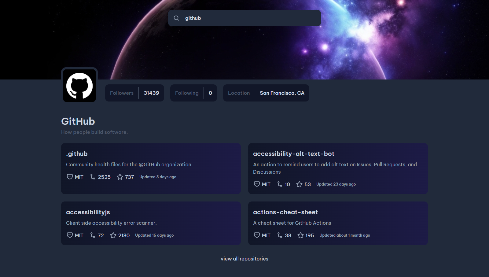
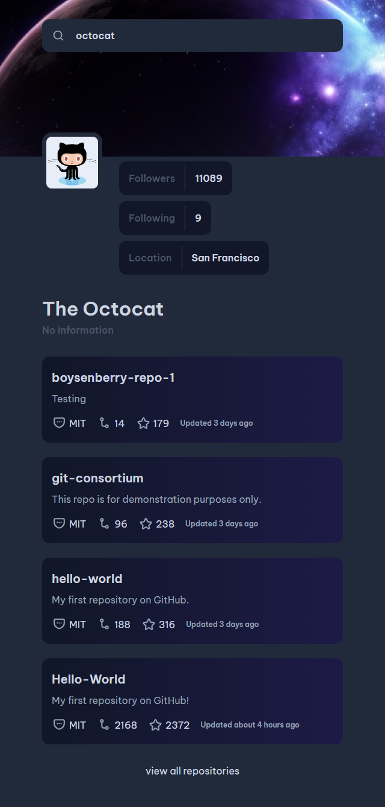
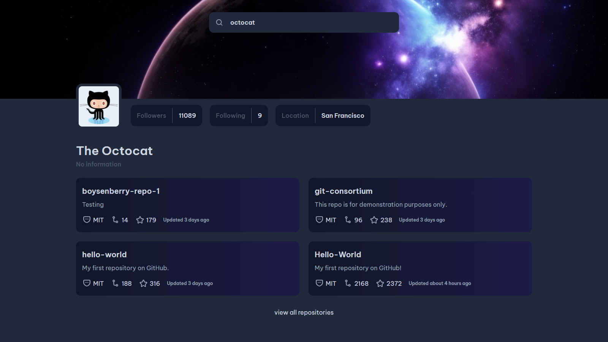

# Dev Challenges - Github Profile Search

## Welcome! 👋

This is a solution to the [Github Profile Search Challenge on devchallenges.io](https://devchallenges.io/challenge/42). It was a great challenges to practice multiple API request.

## Links

- Demo Links: [Demo Links here](https://dev-challenges-github-profile-search.vercel.app/)
- Solution Links: [Solution Links here](https://devchallenges.io/solution/2305)

## Built With

- Vue Js
- Axios
- Date fns
- Sass
- Yarn
- Vite

## Screenshots

### Mobile

### Desktop

## Author

- GitHub - [Souleymane Sy](https://github.com/SouleymaneSy7)
- Dev Challenges - [Souleymane Sy](https://devchallenges.io/profile/534cd213-3165-4c16-bdcf-058e1f468da0)
- Frontend Mentor - [@SouleymaneSy7](https://www.frontendmentor.io/profile/SouleymaneSy7)
- Twitter - [@Souleymanesy43](https://twitter.com/Souleymanesy43)
